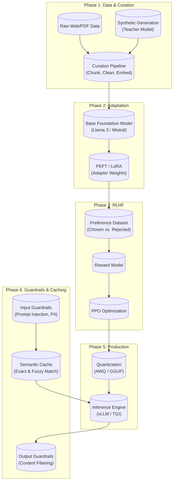

# Frontier LLMOps Core

An end-to-end engineering workspace for the modern Large Language Model lifecycle.

## Repository Structure

| Phase | Directory | Description |
|-------|-----------|-------------|
| 1 | [`01_data_curation/`](01_data_curation/) | Synthetic data generation, chunking, embeddings, quality filtering |
| 2 | [`02_peft_tuning/`](02_peft_tuning/) | QLoRA fine-tuning with PEFT and bitsandbytes (Colab-ready) |
| 3 | [`03_alignment_rlhf/`](03_alignment_rlhf/) | RLHF — reward model, PPO, DPO alignment (Colab-ready) |
| 4 | [`04_eval_and_metrics/`](04_eval_and_metrics/) | LLM-as-a-judge evaluation and automated metrics |
| 5 | [`05_serving_inference/`](05_serving_inference/) | vLLM serving, AWQ quantisation, GGUF export (Colab-ready) |
| 6 | [`06_cache_guardrails/`](06_cache_guardrails/) | Input/output guardrails and semantic response caching |

Each phase has its own `README.md` with theory, usage, and references, a `pyproject.toml` for dependencies, and runnable scripts with `argparse` CLI.

## Overview

This repository bridges the gap between using standard LLM APIs and engineering custom, aligned, and optimized foundational models. It is structured sequentially to follow the lifecycle of an AI product from raw text to high-throughput inference, with an added safety and efficiency layer.

## Pipeline (implemented)

- **[01_data_curation](01_data_curation/):** Synthetic data pipeline using OpenAI API to generate domain-specific prompt-completion pairs, with configurable chunking strategies, sentence-transformer embeddings, and quality filters.
- **[02_peft_tuning](02_peft_tuning/):** QLoRA fine-tuning on Mistral 7B using `peft` and `bitsandbytes`. Dry-run mode validates the pipeline on CPU with GPT-2; Colab notebook for full training on T4 GPU.
- **[03_alignment_rlhf](03_alignment_rlhf/):** Preference dataset parsing (Anthropic HH-RLHF), reward model training, PPO, and DPO alignment via `trl`. Comparable dry-run and Colab support.
- **[04_eval_and_metrics](04_eval_and_metrics/):** LLM-as-a-judge (GPT-4o) scoring with rubric, plus BLEU/ROUGE/BERTScore/METEOR. Generates markdown reports with charts.
- **[05_serving_inference](05_serving_inference/):** vLLM server with continuous batching, AWQ quantisation, GGUF export instructions, and latency/throughput benchmarking. Colab notebook for quantisation.
- **[06_cache_guardrails](06_cache_guardrails/):** Input guardrails (prompt injection, PII detection), output guardrails (toxicity, topic filtering), and a semantic response cache (Redis or in-memory) with configurable similarity threshold.

## Hardware Notes

- **Phases 1, 4, 6**: Fully CPU-runnable
- **Phases 2, 3, 5**: GPU required for full training/serving. Each provides a `--dry-run` mode (CPU, tiny model) to validate the pipeline, and a Colab notebook for T4/cloud GPU execution.
