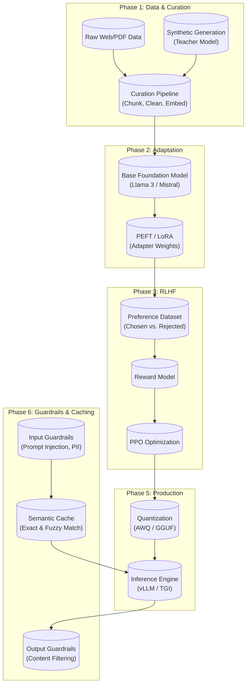

# Frontier LLMOps Core

An end-to-end engineering workspace for the modern Large Language Model lifecycle.

## Overview

This repository bridges the gap between using standard LLM APIs and engineering custom, aligned, and optimized foundational models. It is structured sequentially to follow the lifecycle of an AI product from raw text to high-throughput inference.

## Future Roadmap & Implementation Pipeline

- **01_data_curation:** Build a synthetic data pipeline hitting the OpenAI API to generate complex, edge-case medical/technical prompt-completion pairs.
- **02_peft_tuning:** Implement a QLoRA fine-tuning script using `peft` and `bitsandbytes` to train a local model on consumer hardware.
- **03_alignment_rlhf:** Parse the Anthropic HH-RLHF dataset and use Hugging Face `trl` to train a basic reward model.
- **04_eval_and_metrics:** Write a deterministic LLM-as-a-judge evaluation script that scores local model outputs against GPT-4 baselines.
- **05_serving_inference:** Export a fine-tuned model to `.gguf` format and serve it locally with continuous batching via `vLLM`.
- **06_cache_guardrails:** Implement input guardrails (prompt injection, PII detection), output guardrails (content filtering), and a semantic response cache to reduce redundant inference. (Frameworks TBD — e.g., Guardrails AI, NeMo Guardrails.)
